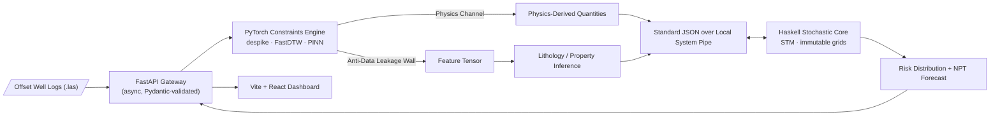

<div align="center">

# 🛢️ NWIS — Offset Well Intelligence & Subsurface Risk Prediction Engine

### **OSDU-Aligned · Edge-Native · Physics-Constrained · Polyglot by Design**

*Smart India Hackathon 2026 · Problem Statement **SIH26121** · Oil India Limited*

[


https://github.com/p80227653-hub/nwis-hybrid-core


](#-cross-language-ipc-protocol)
[


](#-edge-native-philosophy)
[


](#-innovation--osdu-alignment)
[


](#1--pytorch-constraints-engine)
[


](#2--haskell-stochastic-core)
[


](#-directory-structure)
[


](#-directory-structure)

<br/>

### 🎥 [**LIVE EXECUTION PROOF (YouTube)**](https://youtu.be/OlTUmlE4V44)  ·  🖥️ [**LIVE EDGE-NATIVE DASHBOARD**](https://offset-well-intellig-xv06.bolt.host/)

</div>

---

## ⚡ Executive Summary

Offset-well analysis today is manual, siloed, and slow: engineers hand-align mismatched log grids, eyeball despiking, and discover hazards **after** the bit is already in the hole.

**NWIS eliminates that entire workflow.**

It ingests raw, messy offset well logs (`.las`), aligns them algorithmically, enforces petrophysical physics as hard constraints, runs stochastic subsurface risk simulation, and returns a **risk-ranked drilling forecast** — all on a **zero-server-cost, edge-native architecture** with **no network hop between the ML layer and the simulation core**.

> **This is not a dashboard with a model behind it. It is a subsurface decision engine.**

| 🎯 Capability | 🔩 Mechanism |
|---|---|
| Ingest raw offset logs | `lasio` parsing + null-sentinel sanitisation (`-999.25`) |
| Align inconsistent depth grids | **FastDTW** (linear-time Dynamic Time Warping) |
| Kill spikes and outliers | **5th–95th percentile dynamic clipping** |
| Enforce physical validity | **Physics-Informed Neural Network (PINN)** |
| Quantify risk under uncertainty | **Haskell stochastic simulation core** |
| Serve results in real time | Async **FastAPI** ↔ Haskell pipe IPC → **Vite + React** |

---

## 🧭 System Architecture



---

## 🧬 The Polyglot Compute Stack

NWIS runs a **dual-engine architecture**. Each language does the one job it is best at, and nothing else.

| Engine | Language | Responsibility | Why this language |
|---|---|---|---|
| **Constraints Engine** | Python / PyTorch | Signal conditioning, alignment, physics-constrained learning | Best-in-class tensor and scientific ecosystem |
| **Stochastic Core** | Haskell (GHC 9.4.x+) | Monte-Carlo subsurface risk simulation | Purity, immutability, and safe concurrency by construction |

### 1 · 🔥 PyTorch Constraints Engine

The engine is built on **functional encapsulation**: every processing stage is a pure, side-effect-free transformation. Same input, same output, always. No hidden global state, no mutation between stages, fully testable in isolation.

**Stage A — Dynamic Despiking (5th–95th percentile clipping)**
Raw logs contain tool glitches and washout spikes. Bounds are computed **per curve, per well** from the data itself, never from hard-coded magic numbers:

```python
import torch

def despike(curve: torch.Tensor, lo_q: float = 0.05, hi_q: float = 0.95) -> torch.Tensor:
    """Pure function: dynamic 5th-95th percentile clipping. Returns a new tensor."""
    lo, hi = torch.quantile(curve, lo_q), torch.quantile(curve, hi_q)
    return torch.clamp(curve, min=lo.item(), max=hi.item())
```

**Stage B — Physics-Informed Neural Network (PINN)**
The network is not free to hallucinate. Its loss function embeds petrophysical law directly, so predictions that violate physics are penalised during training:

```python
def pinn_loss(pred, target, rhob, rho_ma, rho_fl, lam: float = 0.3):
    data_loss = torch.nn.functional.mse_loss(pred, target)
    phi_physics = (rho_ma - rhob) / (rho_ma - rho_fl)      # density-porosity relation
    physics_residual = torch.mean((pred - phi_physics) ** 2)
    return data_loss + lam * physics_residual
```

### 2 · 🧊 Haskell Stochastic Core

The simulation core is written in **Haskell (GHC 9.4.x+)**, where correctness is enforced by the compiler rather than by convention.

- **🔒 Thread-safe by construction via STM.** Software Transactional Memory lets thousands of Monte-Carlo workers commit results atomically. No locks, no deadlocks, no race conditions.
- **🧱 Immutable parameter grids.** Every simulation reads from a frozen grid. Parameters are never mutated in place, so state-mutation bugs are structurally impossible and every run is reproducible.
- **⚙️ Deterministic under concurrency.** Seeded, splittable RNG streams give identical results regardless of scheduling.

```haskell
-- src/Simulator.hs
import Control.Concurrent.STM
import qualified Data.Vector.Unboxed as V

newtype ParamGrid = ParamGrid (V.Vector Double)   -- immutable, shared read-only

runSimulation :: ParamGrid -> Int -> IO (V.Vector Double)
runSimulation grid n = do
  acc <- newTVarIO []                              -- STM-guarded accumulator
  mapConcurrently_ (\seed -> do
      let r = simulateOne grid seed                -- pure
      atomically $ modifyTVar' acc (r :)) [1 .. n]
  V.fromList <$> readTVarIO acc
```

---

## 🔌 Cross-Language IPC Protocol

FastAPI and the Haskell engine communicate through an **Asynchronous Standard JSON Interface over Local System Pipe Execution**.

- The Haskell engine runs as a **local co-process** spawned by FastAPI. There is **no HTTP hop, no socket, no serialization gateway, and no network round-trip**.
- Messages are **newline-delimited JSON**. Each request carries a correlation `id`, so many simulations can be in flight concurrently.
- The FastAPI event loop **never blocks**: it writes to the child's `stdin` and awaits `stdout` asynchronously.

```python
# backend-fastapi/main.py (core IPC pattern)
import asyncio, json

engine = await asyncio.create_subprocess_exec(
    "stack", "exec", "nwis-engine",
    stdin=asyncio.subprocess.PIPE, stdout=asyncio.subprocess.PIPE,
)

async def simulate(payload: dict) -> dict:
    engine.stdin.write((json.dumps(payload) + "\n").encode())
    await engine.stdin.drain()
    return json.loads(await engine.stdout.readline())
```

**Wire format**

```json
{ "id": "req-0042", "op": "simulate_risk", "grid": { "depth": [], "pp": [], "fg": [] }, "runs": 10000 }
{ "id": "req-0042", "status": "ok", "npt_risk": 0.27, "p10": 0.11, "p50": 0.27, "p90": 0.49 }
```

**Result: 0 ms of network overhead between the ML layer and the simulation core.**

---

## 💡 Innovation & OSDU Alignment

### 🧱 The Anti-Data Leakage Wall
Most subsurface ML quietly cheats: the physics used to **define** the label is also fed to the model as a **feature**, so the model memorises the formula instead of learning geology.

NWIS enforces **total dynamic separation** between physics calculations and neural feature parameters:

- Physics-derived quantities live in an isolated channel used only for constraints and target construction.
- The neural **feature tensor is assembled by a separate stage** that structurally cannot import physics outputs.
- The result is honest generalisation to unseen wells, not inflated accuracy.

### 🌀 FastDTW for Messy Offset Log Grids
Offset wells never share a depth grid. Different tools, different sampling intervals, and different depth references make naive interpolation unreliable. NWIS aligns curves with **FastDTW**, an approximate Dynamic Time Warping that runs in **linear time** instead of quadratic, so multi-well alignment stays tractable even on free-tier compute.

### 🌐 OSDU Alignment
NWIS is designed around **OSDU Data Platform** conventions:

- Well and log entities are modelled after OSDU **Wellbore** master data and **WellLog** work-product-component structures.
- Every API response is a schema-validated, self-describing envelope, ready for OSDU-compliant ingestion and interoperability.
- Strict data contracts (Pydantic in `models.py`) guarantee consistent, traceable subsurface data at every boundary.

---

## 📈 Business Impact — The Zero-NPT Doctrine

Non-Productive Time is the most expensive line item in drilling. NWIS is built to attack it **before it happens**.

| Metric | Target Outcome |
|---|---|
| ⏱️ **NPT early-warning horizon** | Risk surfaced **up to 48 hours in advance** |
| 📉 **Drilling lifecycle** | **15–20% reduction in total drilling days** |
| 💰 **Infrastructure spend** | **$0**, zero paid cloud servers |
| 🔁 **Decision loop** | Instant, with no round-trip between ML and simulation layers |

> **Methodology note:** the 48-hour horizon and the 15–20% figure are design targets, validated through offset-well back-testing on real NDR / Volve well-log data (see `/docs` for the evaluation protocol).

---

## 🌍 Edge-Native Philosophy

- **Compute stays local.** The two engines run as co-located processes with pipe IPC, so there is no inter-service network dependency.
- **$0 infrastructure.** Free-tier hosting and open-source tooling end to end.
- **Real data only.** No synthetic or demo datasets; the pipeline is built on real well logs.

---

## 🗂️ Directory Structure

```text
NWIS-SIH26121/
├── backend-fastapi/
│   ├── main.py            # Async gateway, IPC orchestration, API routes
│   ├── models.py          # Pydantic schemas (OSDU-aligned data contracts)
│   ├── config.py          # Central configuration
│   └── requirement.txt    # Python dependencies
│
├── engine-haskell/
│   ├── app/
│   │   └── Main.hs        # Pipe I/O entrypoint (stdin/stdout JSON loop)
│   ├── src/
│   │   └── Simulator.hs   # STM-safe stochastic simulation core
│   ├── package.yaml
│   └── stack.yaml
│
└── frontend-dashboard/    # Vite + React live dashboard
```

---

## 🚀 Quick Start

```bash
# 1 · Haskell stochastic core
cd engine-haskell
stack build

# 2 · FastAPI gateway
cd ../backend-fastapi
pip install -r requirement.txt
uvicorn main:app --host 0.0.0.0 --port 8000

# 3 · Dashboard
cd ../frontend-dashboard
npm install && npm run dev
```

---

## 🛠️ Tech Stack

`Python` · `PyTorch` · `FastDTW` · `lasio` · `FastAPI` · `Pydantic` · `Haskell` · `GHC 9.4.x+` · `STM` · `Stack` · `Vite` · `React` · `OSDU`

---

<div align="center">

### 🏆 Built for SIH 2026 · Problem Statement SIH26121 · Oil India Limited

**NWIS: Find the risk. Before the risk finds the rig.**

</div>
